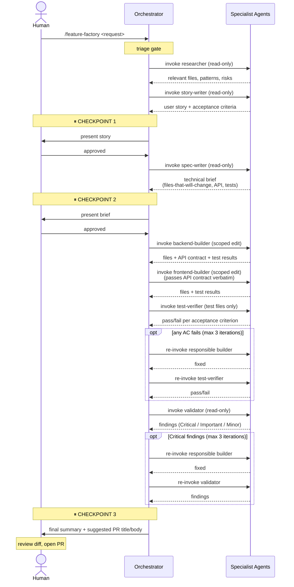

# ai-factory

Central factory for the 7-agent software factory pattern. Generates platform-specific files (Claude Code, Kiro, Cursor, Codex CLI, Windsurf) for many polyrepos from a single source of truth.

Designed for the case: **many repos, many techs, many AI platforms.**

## What it is

- **Prompts library** — 7 agent + 3 skill prompts written once, platform-neutral and stack-neutral.
- **Profile library** — pre-written rule packs per stack (Next.js, Node+Fastify, Go+Echo, Python+FastAPI, etc.).
- **Platform adapters** — code that renders prompts + profile + per-repo manifest into the right files for each AI platform.
- **CLI** — `factory install` reads `.factory.yaml` in any repo and generates everything.

## Architecture: AI and human collaboration

The chain is structured so the human stays in the loop where judgment matters, and steps out where the AI is reliable. Three layers, two roles, three checkpoints.

### Layers

| Layer | Owner | What it does |
|-------|-------|--------------|
| Orchestrator (skill) | AI, driven by human input | Chain logic. Decides which agent to invoke next. Pauses for human checkpoints. Routes failures back to the right builder. Does NOT edit files. |
| Specialist agents (7) | AI, with restricted tools | Each does one job in its own fresh context window. Tool scoping prevents agents from doing each other's work. |
| Reviewer | Human | Approves story, approves brief, reviews diff before merge. Tunes the rules over time. |

### The Tier 3 flow (full chain)



### Who decides what

| Decision | Owner | Notes |
|----------|-------|-------|
| Is this worth building? | Human | Trigger the chain. |
| Is the story right? | Human (AI drafts) | Block at CHECKPOINT 1 if not. |
| Is the technical approach sound? | Human (AI drafts) | Block at CHECKPOINT 2 if not. The brief catches architectural mistakes cheaply. |
| Which files to change? | AI (spec-writer) | Bounded by the brief — builders cannot touch files outside this list. |
| What code to write? | AI (builders) | Bounded by the spec + path scoping rules in the per-repo context file. |
| Did the implementation satisfy the story? | AI (test-verifier + validator) | Reported to human; auto-fix loops up to 3 iterations. |
| Is the diff merge-ready? | Human | Block at CHECKPOINT 3 if not. |
| What rules to add when an agent surprises you? | Human | Edit the profile or per-repo context file. This is how the chain improves over time. |

### Why this split

- **Humans are better at:** business judgment, ambiguous trade-offs, catching missing requirements, taste.
- **AI agents are better at:** breadth (reading many files quickly), discipline (checking the same 30 things every time), patience (writing the boring fixtures and edge-case tests).
- **The chain is bad at:** anything not covered by the validator's checklist. That's why the validator's checklist is the most important prompt to keep tuning — every gap the validator misses becomes a new line in its checklist.

The three checkpoints are not bureaucracy. They are where wrong assumptions cost the least to fix. A mistake caught at CHECKPOINT 2 (brief approval) costs a re-prompt. The same mistake caught after the builders run costs hours of rework.

## Repo layout

```
ai-factory/
├── prompts/
│   ├── agents/         ← researcher, story-writer, ... (platform-neutral)
│   └── skills/         ← feature-factory, quick-fix, spike
├── profiles/           ← stack rule packs (nextjs, node-fastify, go-echo, ...)
├── src/
│   ├── cli.ts          ← CLI entrypoint
│   ├── manifest.ts     ← .factory.yaml parsing + validation
│   ├── render.ts       ← prompt/profile composition
│   ├── commands/       ← install (init/sync still stubs)
│   └── platforms/      ← adapters: one per AI platform
└── examples/           ← sample .factory.yaml manifests
```

> Path examples in this README assume the checkout directory is named `ai-factory`. Adjust paths if you cloned it under a different name (e.g., `ai-software-factory`).

Each project repo gets a small `.factory.yaml` manifest (~20 lines) declaring layer, stack profile, commands, paths, and target platforms. `factory install` generates the platform files.

## Install

```bash
cd ai-factory
npm install
```

## Commands at a glance

| Command | What it does |
|---------|--------------|
| `factory init` | Interactive wizard. Creates `.factory.yaml` in the current repo. Detects stack from package.json / go.mod / pyproject.toml. |
| `factory install` | Generates platform files (`.claude/`, `.kiro/`, `AGENTS.md` + `.codex/`, etc.) for one repo, based on its `.factory.yaml` and the chosen profile. |
| `factory sync [--dry-run]` | Reads `factory.workspace.yaml` (or `--workspace <path>`) and runs `install` on every listed repo. Skips repos without a manifest; continues on per-repo failures. |
| `factory feature start <name>` | Scaffolds `<contracts-repo>/features/<name>/` with a `story.md` skeleton + empty `status.yaml`. The story is the single source of truth, shared across every implementing repo. |
| `factory feature pull <name>` | Copies the feature's `story.md` and any committed contract artifacts from the contracts repo into local `.factory/features/<name>/`. Inputs for the chain in this repo. |
| `factory feature ship <name> --contract <path>` | Marks this repo as having shipped the feature; optionally copies a local API contract back into the contracts repo. Updates `status.yaml`. |
| `factory feature list` | Lists features in the contracts repo with ship counts. |
| `factory feature status <name>` | Shows which repos have shipped a feature, when, and at what commit. |

Until the `factory` binary is wired up, invoke any command via `npx tsx /path/to/ai-factory/src/cli.ts <command>`.

## Usage

**Walkthroughs:**
- [`docs/walkthrough.md`](docs/walkthrough.md) — one feature through the full Tier 3 chain in a single repo. What to type at each checkpoint, what the AI returns, common mistakes.
- [`docs/cross-repo.md`](docs/cross-repo.md) — a feature spanning multiple repos via the contract bridge (backend repo → contracts → frontend repo).

In each project repo, create `.factory.yaml` (either run `factory init`, or copy from `examples/` and edit):

```yaml
name: billing-api                          # repo identifier (required)
layer: backend                             # backend | frontend | worker | mobile | fullstack (required)
profile: node-fastify                      # file in profiles/ without .md (required)
factory-repo: ../ai-factory                # path to this checkout (optional, informational)
contracts-repo: ../ai-factory-contracts    # cross-repo contract dir (optional, Phase B)

commands:                                  # required — agents read these
  typecheck: pnpm typecheck
  lint: pnpm lint
  test: pnpm test
  acceptance: pnpm test:integration        # optional — separate acceptance/e2e command

paths:                                     # path scoping for agents (all lists optional)
  backend:                                 # Backend Builder may edit
    - src/routes/**
    - src/services/**
  frontend: []                             # Frontend Builder may edit
  shared:                                  # readable by either builder
    - packages/shared/**
  tests:                                   # Test Verifier may edit
    - tests/integration/**
  forbidden:                               # no agent may edit
    - .env*
    - "**/secrets.*"

dont-do:                                   # optional — appended to CLAUDE.md
  - Do not call the legacy /v1 endpoints.

platforms:                                 # required — which adapters to run
  - claude-code
  - kiro
  - codex
  # - cursor    (stub)
  # - windsurf  (stub)

notes: |                                   # optional — free-form prose appended to CLAUDE.md
  This repo is the authoritative source for billing API contracts.
```

Then run from your project repo:

```bash
npx tsx /path/to/ai-factory/src/cli.ts install
```

This reads your manifest, loads the matching profile, and writes platform-specific files (e.g., `.claude/agents/*.md` + `CLAUDE.md` for Claude Code).

> A global `factory` binary is planned — `package.json` declares `bin: ./bin/factory.mjs`, but that file isn't built yet. Use the `npx tsx` form above until the bin script lands.

## Status

### Phase A — foundation (shipped)

- ✅ Manifest parsing + validation (`.factory.yaml`)
- ✅ Render engine (template substitution + context-file composition)
- ✅ Platform-neutral agent prompts (7 agents, 3 skills)
- ✅ Stack profiles: Next.js App Router, Node+Fastify, Go+Echo, Python+FastAPI, Bun+Hono
- ✅ **Claude Code adapter** — generates `CLAUDE.md` + `.claude/agents/*` + `.claude/skills/*/SKILL.md`
- ✅ `factory install` command

### Phase B — multi-platform + multi-repo (shipped)

- ✅ **Kiro adapter** — generates `.kiro/steering/*` + `.kiro/FACTORY.md`
- ✅ **Codex CLI adapter** — generates `AGENTS.md` + `.codex/agents/*` + executable bash orchestrators in `.codex/orchestrator/*.sh` + `.codex/FACTORY.md`
- ✅ `factory init` — interactive manifest wizard with stack auto-detection
- ✅ `factory sync` — workspace-wide refresh driven by `factory.workspace.yaml`
- ✅ `factory feature start / pull / ship / list / status` — cross-repo contract bridge (MVP)
- ✅ Documentation: [`docs/walkthrough.md`](docs/walkthrough.md) (single repo) + [`docs/cross-repo.md`](docs/cross-repo.md) (polyrepo)

### Build-on-demand (not blockers)

These are deferred until you actually need them. Each is straightforward to add when the use case shows up.

**Adapters**

- ⏳ Cursor adapter (stub — target layout documented in `src/platforms/cursor.ts`)
- ⏳ Windsurf adapter (stub — target layout documented in `src/platforms/windsurf.ts`)

**More stack profiles** — add by writing a markdown file under `profiles/` matching the shape of the existing five (architecture rules, don't-do, default commands, default paths). Likely candidates when you hit them:

- Rust + Axum / Actix
- SvelteKit (fullstack)
- Nuxt 3 (fullstack)
- Django (Python)
- React Native / Flutter (mobile)
- Ruby on Rails
- Spring Boot (Java)
- .NET / ASP.NET Core

**Chain ↔ contract-bridge integration** — currently the user invokes `factory feature pull / ship` manually around the chain. A future iteration can have the skill orchestrator auto-pull on start and auto-ship on completion.

**Contract-format validation** — ensure the backend repo's emitted contract format (OpenAPI, proto, Zod, etc.) matches what the frontend repo's spec-writer expects.

**Status locking** — protect against two developers running `feature ship` on the same repo simultaneously (rare in practice).

**Global `factory` binary** — `package.json` declares `bin: ./bin/factory.mjs`, but that file isn't built yet. Until it lands, invoke via `npx tsx /path/to/ai-factory/src/cli.ts <command>`.

## How prompts work

Each prompt in `prompts/agents/` and `prompts/skills/` is platform-neutral. References to the project context document use the template variable `{{CONTEXT_FILE}}`, which the adapter substitutes at install time (e.g., `CLAUDE.md`, `AGENTS.md`, `.kiro/steering/project.md`).

Stack-specific content (commands, paths, conventions) does NOT live in the prompts. It comes from:

- **Manifest** (per-repo) — commands, paths, layer, repo-specific don't-do rules.
- **Profile** (shared) — architecture rules, conventions, don't-do, default paths/commands.

The render engine in `src/render.ts` composes manifest + profile into the platform's context file. The adapter writes that file plus the agent/skill files in the platform's format.

## How profiles work

A profile is a markdown file under `profiles/`. It contains:
- Architecture rules
- Don't-do list
- Conventions
- Default paths (documentation only — see note below)
- Default commands (documentation only — see note below)

The profile body is **inlined verbatim** into CLAUDE.md (or the platform's context file) under the `## Profile rules` section, including its own markdown headings. When you write a profile, structure it as a self-contained section because its `## Architecture rules` heading ends up nested inside CLAUDE.md's `## Profile rules`.

The "Default paths" and "Default commands" YAML blocks in the profile are **reference documentation only** — they are not parsed. The real values come from the manifest's `paths:` and `commands:` blocks. Treat them as the suggested starting point a manifest author should copy.

To add a profile for a new stack:
1. Create `profiles/<your-stack>.md`.
2. Follow the structure of `profiles/nextjs-app-router.md` as a template.
3. Reference it in a manifest with `profile: <your-stack>`.

## How adapters work

Each adapter implements `PlatformAdapter` in `src/platforms/index.ts`:

```ts
export interface PlatformAdapter {
  name: Platform;
  contextFileName: string;
  generate(args: {
    targetRoot: string;
    manifest: Manifest;
    agents: PromptFile[];
    skills: PromptFile[];
    profileBody: string;
  }): Promise<PlatformWriteResult>;
}
```

`src/platforms/claude-code.ts` is the reference implementation. The stubs in `kiro.ts`, `cursor.ts`, `codex.ts`, `windsurf.ts` document the target layout for each platform — fill them in to enable.

## Cross-repo coordination

For features that touch multiple repos (e.g., backend repo emits a contract, frontend repo consumes it), the factory uses a separate **contracts repo** as the bridge — the place where the user story lives once and where the API contract is exchanged between repos.

**Workflow:**

```bash
# 1. In the backend repo (or wherever the story originates):
factory feature start invoice-reminders
# → scaffolds <contracts-repo>/features/invoice-reminders/story.md + status.yaml
# Edit story.md, then commit + push the contracts repo.

# 2. In the backend repo, pull the (now-committed) story:
factory feature pull invoice-reminders
# → copies story.md into .factory/features/invoice-reminders/
# Then run the chain (Tier 3) referencing that story as input.

# 3. When the backend chain produces an API contract artifact:
factory feature ship invoice-reminders \
  --contract docs/api/invoice-reminders.openapi.yaml \
  --commit $(git rev-parse HEAD)
# → copies the contract into the contracts repo
# → appends this repo to status.yaml's shipped list
# Commit + push the contracts repo.

# 4. In the frontend repo:
factory feature pull invoice-reminders
# → pulls story.md AND api.openapi.yaml into .factory/features/<name>/
# Run the chain with the story + contract as inputs.

# 5. When the frontend ships:
factory feature ship invoice-reminders --commit $(git rev-parse HEAD)
# → marks this repo shipped in status.yaml
```

**On-disk in the contracts repo:**

```
<contracts-repo>/
└── features/
    └── invoice-reminders/
        ├── story.md            # authored once, shared
        ├── api.openapi.yaml    # backend writes; frontend reads
        └── status.yaml         # append-only ship log
```

See [`docs/cross-repo.md`](docs/cross-repo.md) for the full worked example with two repos and the orchestrator skill flow.

**Phase A scope:** CLI commands only. The chain doesn't yet auto-pull on start or auto-ship on completion — invoke manually. Integration with the orchestrator skills is a follow-up.

## License

MIT License

Copyright (c) 2026

Permission is hereby granted, free of charge, to any person obtaining a copy
of this software and associated documentation files (the "Software"), to deal
in the Software without restriction, including without limitation the rights
to use, copy, modify, merge, publish, distribute, sublicense, and/or sell
copies of the Software, and to permit persons to whom the Software is
furnished to do so, subject to the following conditions:

The above copyright notice and this permission notice shall be included in all
copies or substantial portions of the Software.

THE SOFTWARE IS PROVIDED "AS IS", WITHOUT WARRANTY OF ANY KIND, EXPRESS OR
IMPLIED, INCLUDING BUT NOT LIMITED TO THE WARRANTIES OF MERCHANTABILITY,
FITNESS FOR A PARTICULAR PURPOSE AND NONINFRINGEMENT. IN NO EVENT SHALL THE
AUTHORS OR COPYRIGHT HOLDERS BE LIABLE FOR ANY CLAIM, DAMAGES OR OTHER
LIABILITY, WHETHER IN AN ACTION OF CONTRACT, TORT OR OTHERWISE, ARISING FROM,
OUT OF OR IN CONNECTION WITH THE SOFTWARE OR THE USE OR OTHER DEALINGS IN THE
SOFTWARE.
