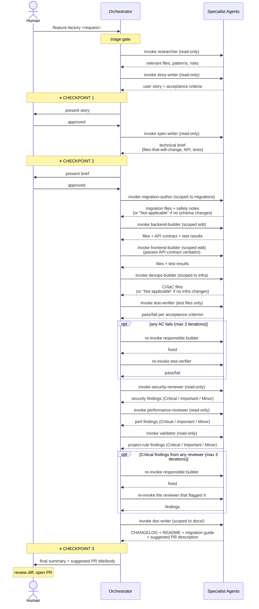

# ai-factory

Central factory for a 12-agent software factory pattern. Generates platform-specific files (Claude Code, Kiro, Codex CLI) for many polyrepos from a single source of truth.

Designed for the case: **many repos, many techs, many AI platforms.**

## What it is

- **Prompts library** — 12 agent + 3 skill prompts written once, platform-neutral and stack-neutral.
- **Profile library** — pre-written rule packs per stack (Next.js, Node+Fastify, Go+Echo, Python+FastAPI, etc.).
- **Platform adapters** — code that renders prompts + profile + per-repo manifest into the right files for each AI platform.
- **CLI** — `factory install` reads `.factory.yaml` in any repo and generates everything.

## Architecture: AI and human collaboration

The chain is structured so the human stays in the loop where judgment matters, and steps out where the AI is reliable. Three layers, two roles, three checkpoints.

### Layers

| Layer | Owner | What it does |
|-------|-------|--------------|
| Orchestrator (skill) | AI, driven by human input | Chain logic. Decides which agent to invoke next. Pauses for human checkpoints. Routes failures back to the right builder. Does NOT edit files. |
| Specialist agents (12) | AI, with restricted tools | Each does one job in its own fresh context window. Tool scoping prevents agents from doing each other's work. |
| Reviewer | Human | Approves story, approves brief, reviews diff before merge. Tunes the rules over time. |

### The Tier 3 flow (full chain)



### Who decides what

| Decision | Owner | Notes |
|----------|-------|-------|
| Is this worth building? | Human | Trigger the chain. |
| Is the story right? | Human (AI drafts) | Block at CHECKPOINT 1 if not. |
| Is the technical approach sound? | Human (AI drafts) | Block at CHECKPOINT 2 if not. The brief catches architectural mistakes cheaply. |
| Which files to change? | AI (spec-writer) | Bounded by the brief — builders cannot touch files outside this list. |
| What code to write? | AI (builders) | Bounded by the spec + path scoping rules in the per-repo context file. |
| Did the implementation satisfy the story? | AI (test-verifier + validator) | Reported to human; auto-fix loops up to 3 iterations. |
| Is the diff merge-ready? | Human | Block at CHECKPOINT 3 if not. |
| What rules to add when an agent surprises you? | Human | Edit the profile or per-repo context file. This is how the chain improves over time. |

### Why this split

- **Humans are better at:** business judgment, ambiguous trade-offs, catching missing requirements, taste.
- **AI agents are better at:** breadth (reading many files quickly), discipline (checking the same 30 things every time), patience (writing the boring fixtures and edge-case tests).
- **The chain is bad at:** anything not covered by the validator's checklist. That's why the validator's checklist is the most important prompt to keep tuning — every gap the validator misses becomes a new line in its checklist.

The three checkpoints are not bureaucracy. They are where wrong assumptions cost the least to fix. A mistake caught at CHECKPOINT 2 (brief approval) costs a re-prompt. The same mistake caught after the builders run costs hours of rework.

## Repo layout

```
ai-factory/
├── prompts/
│   ├── agents/         ← researcher, story-writer, ... (platform-neutral)
│   └── skills/         ← feature-factory, quick-fix, spike
├── profiles/           ← stack rule packs (nextjs, node-fastify, go-echo, ...)
├── src/
│   ├── cli.ts          ← CLI entrypoint
│   ├── manifest.ts     ← .factory.yaml parsing + validation
│   ├── render.ts       ← prompt/profile composition
│   ├── commands/       ← install, init, sync, feature
│   └── platforms/      ← adapters: one per AI platform
└── examples/           ← sample .factory.yaml manifests
```

> Path examples in this README assume the checkout directory is named `ai-factory`. Adjust paths if you cloned it under a different name (e.g., `ai-software-factory`).

Each project repo gets a small `.factory.yaml` manifest (~20 lines) declaring layer, stack profile, commands, paths, and target platforms. `factory install` generates the platform files.

## Install

```bash
cd ai-factory
pnpm install            # or `npm install`
pnpm link --global      # or `npm link` — exposes `factory` globally
factory --version       # should print the version
```

That makes `factory` available from any directory. Skip the `link` step if you'd rather invoke via `npx tsx src/cli.ts <command>` from inside the ai-factory checkout.

## Commands at a glance

| Command | What it does |
|---------|--------------|
| `factory init` | Interactive wizard. Creates `.factory.yaml` in the current repo. Detects stack from package.json / go.mod / pyproject.toml. |
| `factory install` | Generates platform files (`.claude/`, `.kiro/`, `AGENTS.md` + `.codex/`, etc.) for one repo, based on its `.factory.yaml` and the chosen profile. |
| `factory sync [--dry-run]` | Reads `factory.workspace.yaml` (or `--workspace <path>`) and runs `install` on every listed repo. Skips repos without a manifest; continues on per-repo failures. |
| `factory feature start <name>` | Scaffolds `<contracts-repo>/features/<name>/` with a `story.md` skeleton + empty `status.yaml`. Pass `--from <path>` to seed `story.md` from a PM-authored markdown file (Claude.ai / ChatGPT / Notion export — anything). The story is the single source of truth, shared across every implementing repo. |
| `factory feature pull <name>` | Copies the feature's `story.md` and any committed contract artifacts from the contracts repo into local `.factory/features/<name>/`. Inputs for the chain in this repo. |
| `factory feature ship <name> --contract <path>` | Marks this repo as having shipped the feature; optionally copies a local API contract back into the contracts repo. Updates `status.yaml`. |
| `factory feature list` | Lists features in the contracts repo with ship counts. |
| `factory feature status <name>` | Shows which repos have shipped a feature, when, and at what commit. |

After [installing](#install) and linking the CLI globally, invoke any of these with just `factory <command>` from any directory. Otherwise run them as `npx tsx /path/to/ai-factory/src/cli.ts <command>`.

## Usage

**Learn the design:** [`docs/book/`](docs/book/README.md) — the architecture book.
Explains the fundamentals and the *why* behind every major decision, so the system is
easy to learn and to extend. Start there if you're new or planning a change.

**Walkthroughs:**
- [`docs/walkthrough.md`](docs/walkthrough.md) — one feature through the full Tier 3 chain in a single repo. What to type at each checkpoint, what the AI returns, common mistakes.
- [`docs/cross-repo.md`](docs/cross-repo.md) — a feature spanning multiple repos via the contract bridge (backend repo → contracts → frontend repo).

In each project repo, create `.factory.yaml` (either run `factory init`, or copy from `examples/` and edit):

```yaml
name: billing-api                          # repo identifier (required)
layer: backend                             # backend | frontend | worker | mobile | fullstack (required)
profile: node-fastify                      # file in profiles/ without .md (required)
# factory-repo: omitted on purpose — the global `factory` binary knows where it is.
# Only set this if you want to pin a specific local checkout for an unusual workflow.
contracts-repo: ../ai-factory-contracts    # cross-repo contract dir (optional, Phase B)

commands:                                  # required — agents read these
  typecheck: pnpm typecheck
  lint: pnpm lint
  test: pnpm test
  acceptance: pnpm test:integration        # optional — separate acceptance/e2e command

paths:                                     # path scoping for agents (all lists optional)
  backend:                                 # Backend Builder may edit
    - src/routes/**
    - src/services/**
  frontend: []                             # Frontend Builder may edit
  migrations:                              # Migration Author may edit
    - prisma/**
  infra:                                   # DevOps Builder may edit
    - .github/workflows/**
  docs:                                    # Doc Writer may edit
    - docs/**
    - CHANGELOG.md
  shared:                                  # readable by either builder
    - packages/shared/**
  tests:                                   # Test Verifier may edit
    - tests/integration/**
  forbidden:                               # no agent may edit
    - .env*
    - "**/secrets.*"

dont-do:                                   # optional — appended to CLAUDE.md
  - Do not call the legacy /v1 endpoints.

models:                                    # optional — per-agent model override
  story-writer: sonnet                     # agents you omit follow the session default
  doc-writer: sonnet

hooks:                                     # optional — both default to false
  stop-on-failing-validation: true         # don't end a turn while checks fail
  capture-agent-output: true               # record each agent's output to .factory/runs/

sandbox: true                              # optional, default false — OS-level Bash
                                           # sandbox; also denies writes to `forbidden:`
                                           # for subprocesses (Claude Code only)

platforms:                                 # required — which adapters to run
  - claude-code
  - kiro
  - codex

notes: |                                   # optional — free-form prose appended to CLAUDE.md
  This repo is the authoritative source for billing API contracts.
```

Then run from your project repo:

```bash
factory install        # if you ran `pnpm link --global`
# or:
npx tsx /path/to/ai-factory/src/cli.ts install
```

This reads your manifest, loads the matching profile, and writes platform-specific files (e.g., `.claude/agents/*.md` + `CLAUDE.md` for Claude Code).

## Keeping things in sync (updating)

Three layers can drift over time: the central `ai-factory` checkout, the global `factory` binary, and the per-repo generated files. Update flow:

### Refresh the central factory

```bash
cd /path/to/ai-factory
git pull                # pulls new prompts, profiles, adapter changes
pnpm install            # only if dependencies changed
```

The `pnpm link --global` from initial setup still points at this directory, so the global `factory` command picks up new code automatically — no re-link needed unless you blew away `node_modules`.

### Refresh one project

In any repo that already has `.factory.yaml`:

```bash
cd /path/to/your-project
factory install
git status                                    # see what changed
git add CLAUDE.md .claude .factory.yaml       # whatever the diff shows
git commit -m "chore: update factory artifacts"
```

That's it. Re-running install regenerates everything from the current state of the central factory. The new agents / prompts / profile rules land in place.

### Refresh many projects at once

If you maintain a workspace file listing your repos:

```bash
factory sync               # re-installs every listed repo
factory sync --dry-run     # preview what would happen
```

Useful when a central prompt or profile change needs to propagate across 5+ repos.

### What gets preserved vs overwritten

| Overwritten on every install | Preserved |
|------------------------------|-----------|
| `CLAUDE.md` | `.factory.yaml` (your manifest — never overwritten) |
| `.claude/agents/*.md`, `.claude/skills/*/SKILL.md` | `.gitignore` (your changes stay) |
| `.claude/hooks/factory-guard.mjs` + `.claude/hooks/factory-scope.json` (if `forbidden:` or any path allow-list is set) | `.claude/settings.json` — **merged, not overwritten**: only the factory's path-guard `PreToolUse` hook and the `permissions.deny` rules derived from `forbidden:` are added/refreshed; your other settings, hooks and permission rules are kept |
| `.kiro/steering/*`, `.kiro/skills/*`, `.kiro/FACTORY.md` (if Kiro platform) | Anything else in the repo (`src/`, `tests/`, etc.) |
| `AGENTS.md`, `.codex/agents/*`, `.codex/orchestrator/*.sh`, `.codex/FACTORY.md` (if Codex platform) | `.codex/runs/**` (run history — never touched) |

**Hard rule:** never hand-edit generated files. Edit the manifest, the profile, or the central prompts — then re-run `factory install`. Otherwise your edits are lost next sync.

### When you need to change something — where to edit

| You want to change | Edit |
|--------------------|------|
| The repo's commands, paths, or repo-specific don't-do rules | `.factory.yaml` in that project repo |
| Architecture rules / conventions for a whole stack | `ai-factory/profiles/<name>.md`, then sync all repos using that profile |
| An agent's behavior (e.g., make validator stricter) | `ai-factory/prompts/agents/<name>.md` |
| The orchestration chain | `ai-factory/prompts/skills/feature-factory.md` |
| Platform-specific output shape | `ai-factory/src/platforms/<name>.ts` |

After editing anything in the central `ai-factory/`: `git push` → in each project: `factory install` (or one-shot `factory sync`).

### TL;DR

```bash
(cd /path/to/ai-factory && git pull)        # 1. refresh central
cd /path/to/your-project                    # 2. enter project
factory install                             # 3. regenerate
```

## Status

### Phase A — foundation (shipped)

- ✅ Manifest parsing + validation (`.factory.yaml`)
- ✅ Render engine (template substitution + context-file composition)
- ✅ Platform-neutral agent prompts (12 agents, 3 skills)
- ✅ Stack profiles: Next.js App Router, Node+Fastify, Go+Echo, Python+FastAPI, Bun+Hono, Quarkus Reactive (Java), React + Vite, React + rsbuild + Module Federation (micro-frontend), Python library
- ✅ **Claude Code adapter** — generates `CLAUDE.md` + `.claude/agents/*` + `.claude/skills/*/SKILL.md`, plus a `PreToolUse` path-guard hook (`.claude/hooks/factory-guard.mjs` + `.claude/hooks/factory-scope.json` + merged `.claude/settings.json`) that **enforces** the manifest's `forbidden:` list and per-agent allow-lists at the tool level — out-of-scope edits are blocked, not just discouraged by prose
- ✅ `factory install` command

### Phase B — multi-platform + multi-repo (shipped)

- ✅ **Kiro adapter** — generates `.kiro/steering/*` (IDE context + agents) + `.kiro/skills/*/SKILL.md` (native Agent Skills) + `.kiro/agents/*.json` (Kiro CLI) + `.kiro/FACTORY.md`. Path scoping is **enforced on the CLI** via a `preToolUse` hook on `fs_write` (same guard as Claude Code); the IDE flow stays prompt-only
- ✅ **Codex CLI adapter** — generates `AGENTS.md` + `.codex/agents/*` + executable bash orchestrators in `.codex/orchestrator/*.sh` + `.codex/FACTORY.md`. Path scoping is **enforced** by a post-run git-diff check (`.codex/factory-check.mjs`) that reverts out-of-scope edits and halts the chain
- ✅ `factory init` — interactive manifest wizard with stack auto-detection
- ✅ `factory sync` — workspace-wide refresh driven by `factory.workspace.yaml`
- ✅ `factory feature start / pull / ship / list / status` — cross-repo contract bridge (MVP)
- ✅ Documentation: [`docs/walkthrough.md`](docs/walkthrough.md) (single repo) + [`docs/cross-repo.md`](docs/cross-repo.md) (polyrepo)

### Build-on-demand (not blockers)

These are deferred until you actually need them. Each is straightforward to add when the use case shows up.

**Adapters**

- ⏳ Cursor / Windsurf — not implemented. Both are rules-file (context-injection) tools with no generatable enforcement hook, so an adapter would be prompt-only (like the Kiro IDE flow). Add one by implementing `PlatformAdapter` in `src/platforms/` and registering it in `src/platforms/index.ts` — see Chapter 8 of the book.

**More stack profiles** — add by writing a markdown file under `profiles/` matching the shape of the existing profiles (architecture rules, don't-do, default commands, default paths). Likely candidates when you hit them:

- Rust + Axum / Actix
- SvelteKit (fullstack)
- Nuxt 3 (fullstack)
- Django (Python)
- React Native / Flutter (mobile)
- Ruby on Rails
- Spring Boot (Java, blocking)
- .NET / ASP.NET Core

**Chain ↔ contract-bridge integration** — currently the user invokes `factory feature pull / ship` manually around the chain. A future iteration can have the skill orchestrator auto-pull on start and auto-ship on completion.

**Contract-format validation** — ensure the backend repo's emitted contract format (OpenAPI, proto, Zod, etc.) matches what the frontend repo's spec-writer expects.

**Status locking** — protect against two developers running `feature ship` on the same repo simultaneously (rare in practice).

~~Global `factory` binary~~ — **shipped.** `bin/factory.mjs` is a tsx-spawn shim; `pnpm link --global` (or `npm link`) installs it globally so `factory <command>` works from any directory.

## How prompts work

Each prompt in `prompts/agents/` and `prompts/skills/` is platform-neutral. References to the project context document use the template variable `{{CONTEXT_FILE}}`, which the adapter substitutes at install time (e.g., `CLAUDE.md`, `AGENTS.md`, `.kiro/steering/project.md`).

Stack-specific content (commands, paths, conventions) does NOT live in the prompts. It comes from:

- **Manifest** (per-repo) — commands, paths, layer, repo-specific don't-do rules.
- **Profile** (shared) — architecture rules, conventions, don't-do, default paths/commands.

The render engine in `src/render.ts` composes manifest + profile into the platform's context file. The adapter writes that file plus the agent/skill files in the platform's format.

## How profiles work

A profile is a markdown file under `profiles/`. It contains:
- Architecture rules
- Don't-do list
- Conventions
- Default paths (seed values for `factory init` — see note below)
- Default commands (seed values for `factory init` — see note below)

The profile body is **inlined verbatim** into CLAUDE.md (or the platform's context file) under the `## Profile rules` section, including its own markdown headings. When you write a profile, structure it as a self-contained section because its `## Architecture rules` heading ends up nested inside CLAUDE.md's `## Profile rules`.

The "Default paths" and "Default commands" YAML blocks in the profile are read **only by `factory init`**, which parses them (`src/util/profile-defaults.ts`) to pre-fill the wizard's answers and the generated manifest. `factory install` never reads them: at install time the real values come from the manifest's own `paths:` and `commands:` blocks.

Two consequences worth knowing:

- Editing a profile's defaults changes nothing in repos that already have a `.factory.yaml` — `install` won't pick them up, and the manifest is never overwritten. Existing repos must copy the new values in by hand (or re-run `init --force`).
- A path key the profile suggests but the manifest omits is **not enforced** — the scope guard is generated from the manifest's keys only.

To add a profile for a new stack:
1. Create `profiles/<your-stack>.md`.
2. Follow the structure of `profiles/nextjs-app-router.md` as a template.
3. Reference it in a manifest with `profile: <your-stack>`.

## How adapters work

Each adapter implements `PlatformAdapter` in `src/platforms/index.ts`:

```ts
export interface PlatformAdapter {
  name: Platform;
  contextFileName: string;
  generate(args: {
    targetRoot: string;
    manifest: Manifest;
    agents: PromptFile[];
    skills: PromptFile[];
    profileBody: string;
  }): Promise<PlatformWriteResult>;
}
```

`src/platforms/claude-code.ts` is the reference implementation; `kiro.ts` and `codex.ts` are the other two. To add a platform, implement `PlatformAdapter` and register it in `src/platforms/index.ts`.

### Enforced path scoping (Claude Code)

On Claude Code, path scoping is **enforced**, not just advised:

- The `forbidden:` list is blocked session-wide by a `PreToolUse` hook
  (`.claude/hooks/factory-guard.mjs` + a merged `.claude/settings.json`).
- Each editing agent (`backend`, `frontend`, `tests`, `migrations`, `infra`,
  `docs`) gets a per-agent `PreToolUse` hook in its frontmatter that blocks
  edits outside its allow-list. Lists are **opt-in**: an agent with no list in
  the manifest is unenforced (prompt-only); an empty list means "edit nothing".

> **Opt-in / upgrading existing repos:** the guard is generated from the keys
> present in *your* `.factory.yaml`, which is never overwritten by `install`. A
> manifest written before these keys existed gains enforcement only for the keys
> it already has. To enforce `migrations`/`infra`/`docs` in an existing repo, add
> those keys to `.factory.yaml` (copy the profile's "Default paths" as a starting
> point) and re-run `factory install`.

Limitations: enforcement covers `Write`/`Edit`/`MultiEdit`/`NotebookEdit` only —
a builder's `Bash` access can still write files, so the guard is a guardrail, not
a sandbox.

### Declarative deny rules (Claude Code)

Alongside the hook, every `forbidden:` glob is also emitted into
`.claude/settings.json` as a `permissions.deny` rule — `.env*` becomes
`Edit(.env*)`. The two layers catch different things:

- The **hook** fires on the edit tools, and enforces per-agent allow-lists,
  which permission rules cannot express (they are session-wide).
- The **deny rule** also covers the file commands Claude Code recognises inside
  Bash — `tee`, `sed`, and `> file` redirects — which the hook never sees.

Notes on the mapping: it uses `Edit(...)` and never `Write(...)`, because Claude
Code consults file-path rules for `Read` and `Edit` only (a `Write(...)` path
rule is accepted, never checked, and warns at startup). No matching `Read(...)`
rule is emitted — `forbidden:` means "no agent may edit", and denying reads of
`.env*` would also hide `.env.example`. No glob translation is needed: both
`forbidden:` and Claude Code path rules use gitignore semantics.

Your own rules are left alone. On re-install the factory prunes only the rules
derived from the previous `forbidden:` list (recorded in `factory-scope.json`),
so shrinking or renaming the list cleans up after itself.

Neither layer sees a Node or Python script the agent runs, which opens files
itself. For that, set `sandbox: true` — see below.

### OS-level sandbox (Claude Code, opt-in)

`sandbox: true` in the manifest turns on
[Claude Code's Bash sandbox](https://code.claude.com/docs/en/sandboxing) and
emits every `forbidden:` glob as a `sandbox.filesystem.denyWrite` rule. This is
the layer that finally closes the subprocess hole: enforcement is OS-level
(Seatbelt on macOS, bubblewrap on Linux/WSL2), so it covers a command's **child
processes** too — the script writing the file, not just the tool call.

The rule that makes this work: a `denyWrite` holds inside the wider allow that
makes the repo writable, so denying `./.env*` bites even though the whole
project root is writable.

Two rules are emitted per glob — `./x` and `./**/x`. The syntaxes disagree
about depth: `forbidden:` is gitignore-flavoured, where a bare filename matches
anywhere, while sandbox paths resolve `./x` against the project root and it
isn't documented whether a leading `**/` also matches zero segments. For a deny
list, over-emitting is the safe direction.

Off by default: the sandbox constrains every command in the session, so it
isn't a change to make on a repo's behalf. Turning it back off removes our
rules, and removes `enabled` only if that's all we wrote — a sandbox you
configured yourself is left alone. Not supported on native Windows; run inside
WSL2.

Codex is not wired up. It does have an OS-level sandbox (`sandbox_mode`,
`sandbox_workspace_write.writable_roots`) and per-path permission profiles, but
the two are mutually exclusive — its docs say not to combine them — and
generating a `.codex/config.toml` would mean owning a file that also carries the
user's own Codex configuration. Left alone rather than guessed at.

### Lifecycle hooks (Claude Code, opt-in)

Both default to off. Each changes how a session behaves, which isn't a change to
make on a repo's behalf — the generated output is byte-identical until you ask.

**`stop-on-failing-validation`** wires a `Stop` hook that refuses to end a turn
while `commands.typecheck` or `commands.test` fail. Every builder prompt already
says "run the validation commands, do not return with failing checks"; nothing
verified it. Now the harness runs them, so a builder cannot report green while
the suite is red.

`Stop` fires at the end of *every* turn, so three guards keep it from trapping
the session:

1. `stop_hook_active` short-circuits — a blocked stop can never loop.
2. A clean working tree exits immediately: nothing was edited, nothing to check.
3. The working-tree fingerprint is remembered, so a given state blocks **once**.
   Asking a question in a repo that already has failing tests won't re-block
   every turn.

State lives in the OS temp dir keyed by repo path; nothing is written to the
repo. A repo that isn't a git checkout opts out automatically.

**`capture-agent-output`** wires a `SubagentStop` hook that writes each agent's
final message to `.factory/runs/<session>/NN-<agent>.md`. Chain artifacts
currently exist only inside the orchestrator's context — nothing on disk says
what the researcher found or what contract the backend emitted, so a run can't
be audited, and the orchestrator has to carry every prior output forward as
inlined text. This is the precondition for passing paths instead, and it brings
Claude Code to parity with Codex, whose orchestrators already tee each step into
`.codex/runs/`. It only observes; it never blocks.

Neither is wired for Kiro or Codex yet. Kiro has a documented equivalent
(`.kiro/hooks/*.json`, with an `Agent Stop` trigger); Codex has lifecycle hooks
in `config.toml`. Both are candidates for the platform-parity pass.

### Per-agent model selection

The optional `models:` map in the manifest sets a model per agent. It is emitted
as `model:` in Claude Code agent frontmatter and as `model` in Kiro CLI agent
configs. An agent you don't name gets no `model` key at all and follows the
session default, so leaving `models:` out changes nothing.

No defaults ship with the factory: which agent deserves which model is a quality
judgement that belongs to the repo owner, not to a shared tool. A reasonable
starting point is the agents whose job is transforming text you already gave them
(`story-writer`, `doc-writer`) rather than the ones writing code or judging it.

Codex is not wired up: it selects a model per invocation (`codex exec --model`)
rather than declaratively, so it would need the orchestrator scripts to carry the
map. Not done yet.

### Enforced path scoping (Kiro CLI and Codex)

The same `forbidden:` list and per-agent allow-lists are enforced on the other two
platforms — the mechanism differs, the end state doesn't:

| Platform | Mechanism | When it fires |
|----------|-----------|---------------|
| Claude Code | `PreToolUse` hook → `.claude/hooks/factory-guard.mjs` | Blocks **before** the edit (exit 2) |
| Kiro **CLI** | `preToolUse` hook on `fs_write` in `.kiro/agents/<name>.json` → `.kiro/factory-guard.mjs` (same guard) | Blocks **before** the write (exit 2) |
| Codex | Orchestrator diffs the tree after each `codex exec` → `.codex/factory-check.mjs` | **Reverts after** the agent runs, then halts the chain |

- Codex's post-run check catches `Bash`-written files too (it diffs the working
  tree), so it's slightly stronger on that axis than the pre-edit hooks. It
  self-disables unless `node` and a git repo are present.
- **Kiro IDE stays prompt-only.** The IDE advertises a `Pre Tool Use` hook but its
  on-disk/block contract isn't documented, and declarative `allowedPaths` is
  reportedly not enforced (kirodotdev/Kiro#7799). Use the CLI agents for enforced
  scoping.
- All three are opt-in per agent in the same way: no allow-list in the manifest
  means that agent is prompt-only.

**Why Codex keeps the post-run check even though it now has `PreToolUse`.**
Codex gained lifecycle hooks with the same event schema as Claude Code, so
reusing the shared pre-edit guard looks like an easy win. It isn't. Codex edits
files through `apply_patch`, and its `PreToolUse` payload carries
`tool_input.command` — a string holding the patch — not a file path; the docs
state outright that a hook has no documented way to tell which paths a call will
write. The shared guard reads `tool_input.file_path`, which Codex never sends,
so wiring it up would produce a **silent no-op**: the docs would claim enforced,
and nothing would be. Observing the git tree after the fact is the mechanism
that actually fits this platform, so it stays.

See [Chapter 4 of the book](docs/book/04-path-enforcement.md) for why it's shaped
this way.

## Cross-repo coordination

For features that touch multiple repos (e.g., backend repo emits a contract, frontend repo consumes it), the factory uses a separate **contracts repo** as the bridge — the place where the user story lives once and where the API contract is exchanged between repos.

**Workflow:**

```bash
# 1. In the backend repo (or wherever the story originates):
factory feature start invoice-reminders
# → scaffolds <contracts-repo>/features/invoice-reminders/story.md + status.yaml
# Edit story.md, then commit + push the contracts repo.

# 2. In the backend repo, pull the (now-committed) story:
factory feature pull invoice-reminders
# → copies story.md into .factory/features/invoice-reminders/
# Then run the chain (Tier 3) referencing that story as input.

# 3. When the backend chain produces an API contract artifact:
factory feature ship invoice-reminders \
  --contract docs/api/invoice-reminders.openapi.yaml \
  --commit $(git rev-parse HEAD)
# → copies the contract into the contracts repo
# → appends this repo to status.yaml's shipped list
# Commit + push the contracts repo.

# 4. In the frontend repo:
factory feature pull invoice-reminders
# → pulls story.md AND api.openapi.yaml into .factory/features/<name>/
# Run the chain with the story + contract as inputs.

# 5. When the frontend ships:
factory feature ship invoice-reminders --commit $(git rev-parse HEAD)
# → marks this repo shipped in status.yaml
```

**On-disk in the contracts repo:**

```
<contracts-repo>/
└── features/
    └── invoice-reminders/
        ├── story.md            # authored once, shared
        ├── api.openapi.yaml    # backend writes; frontend reads
        └── status.yaml         # append-only ship log
```

See [`docs/cross-repo.md`](docs/cross-repo.md) for the full worked example with two repos and the orchestrator skill flow.

**Current scope:** The chain *consumes* a pulled feature bundle — the orchestrator reads `story.md` and any published `api.*` contract from `.factory/features/<name>/`, and the spec-writer/frontend-builder build on that contract. What's still manual is the **pull/ship invocation itself**: you run `factory feature pull` / `ship` by hand around the chain; the orchestrator doesn't auto-pull on start or auto-ship on completion. Auto-pull/ship is a follow-up (see "Build-on-demand" under Status).

## License

MIT License

Copyright (c) 2026

Permission is hereby granted, free of charge, to any person obtaining a copy
of this software and associated documentation files (the "Software"), to deal
in the Software without restriction, including without limitation the rights
to use, copy, modify, merge, publish, distribute, sublicense, and/or sell
copies of the Software, and to permit persons to whom the Software is
furnished to do so, subject to the following conditions:

The above copyright notice and this permission notice shall be included in all
copies or substantial portions of the Software.

THE SOFTWARE IS PROVIDED "AS IS", WITHOUT WARRANTY OF ANY KIND, EXPRESS OR
IMPLIED, INCLUDING BUT NOT LIMITED TO THE WARRANTIES OF MERCHANTABILITY,
FITNESS FOR A PARTICULAR PURPOSE AND NONINFRINGEMENT. IN NO EVENT SHALL THE
AUTHORS OR COPYRIGHT HOLDERS BE LIABLE FOR ANY CLAIM, DAMAGES OR OTHER
LIABILITY, WHETHER IN AN ACTION OF CONTRACT, TORT OR OTHERWISE, ARISING FROM,
OUT OF OR IN CONNECTION WITH THE SOFTWARE OR THE USE OR OTHER DEALINGS IN THE
SOFTWARE.
